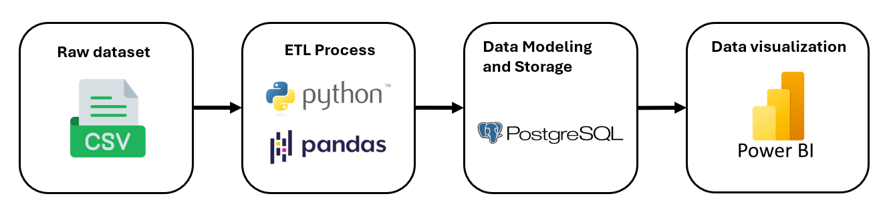
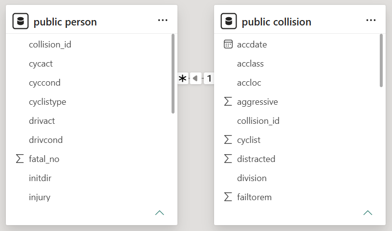
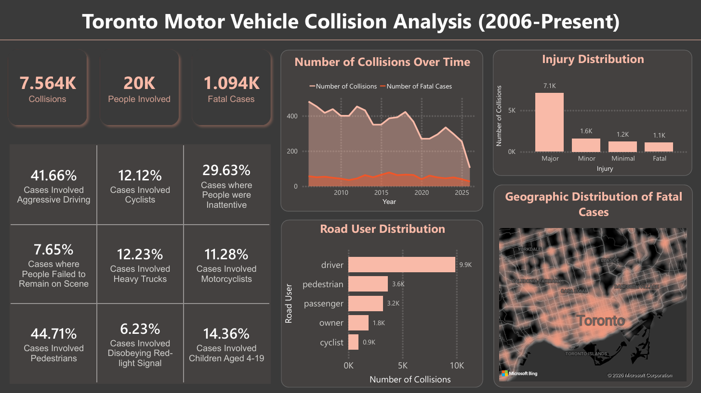

# Toronto KSI Motor Vehicle Collision Analysis

## 1. Overview
This project is an end-to-end data analytics pipeline that analyzes <b>Killed or Seriously Injured (KSI) motor vehicle collisions</b> in the City of Toronto. The objective is to identify trends, geographic hotspots, contributing factors, and injury patterns that can help understand road safety issues and support decision making.

## 2. Research Questions
The analysis focuses on several questions:

- How has the frequency and severity of KSI collisions changed over time?
- Who is most affected by serious collisions?
- Where are KSI collisions concentrated?
- What behaviours and conditions are associated with collisions? (aggressive driving, distracted driving, weather, lighting, ...)

## 3. Dataset
Source: 

The dataset contains records of every person involved in a Killed or Seriously Injured (KSI) motor vehicle collision occuring on Toronto roadways since 2006.

Each record represents one involved persion, while collision-level information is repeated for every individual involved in the same collision. 

The dataset includes information such as:
- Collision date and location
- Road conditions
- Vehicle information, road user type
- Injury severity
- Geographic coordinates
- Contributing factors (aggressive driving, distraction, red-light violations,...)

## 4. Tech Stack
- <b>ETL:</b> Python (pandas, SQLAlchemy, psycopg2)
- <b>Databases:</b> SQL, PostgreSQL
- <b>Visualization:</b> Power BI

## 5. The analytics workflow
The analytics workflow includes data extraction, transformation, loading, database design, and dashboard development.

### 5.1 Extract
- Loaded the raw CSV into Pandas for preprocessing

### 5.2 Transform
- Removed duplicated records
- Normalized the dataset into separate Collision and Person tables
- Validated data quality and relationships between collision and person records
- Prepared the dataset for relational database loading

### 5.3 Load
- Designed and created a PostgreSQL relational database
- Loaded transformed data into normalized tables
- Established a one-to-many relationship between collisions and involved people

### 5.4 Database Design
The original dataset stores one row for each person involved in a collision. To reduce redundancy, the data was normalized into 2 tables:

- <b>Collision:</b> Stores event-level information (collision date, location, weather, road condition, traffic control, geographic coordinates, etc.)

- <b>Person:</b> Stores person-level information (road user, age, injury severity, vehicle type, driver behaviour, safety equipment, etc.)

### 5.5 Power BI Dashboard
The dashboard explores multiple aspects of KSI collisions, including: overall collisison statistics, trends over time, geographic hotspots, injury severity, road user distribution, driver behaviour and contributing factors, road conditions

## 6. Key Findings
<b>Overall Statistics:</b>
- 7.564K KSI collision events were recorded
- 20K people were involved in these collisions
- 1094 fatal injuries
- 41.66% of the KSI collisions involved aggressive driving behaviours, including speeding, improper passing, or disobeying traffic controls.
- 44.71% of the collisions involved pedestrians

<b>Collision Trends over Time:</b>
- The total number of KSI collisions has generally decreased over time. However, the number of fatal injuries has remained relatively stable with small fluctuations, suggesting that while collisions are becoming less frequent, their severity has not declined at the same rate

<b>Injury Severity:</b>
- The majority of recorded injuries were classified as Major injuries, while fatal injuries represented a smaller but significant proportion.

<b>Road User Distribution</b>
- Drivers accounted for the largest share of people involved in KSI collisions, followed by pedestrians and passengers. Cyclists, vehicle owners, and other road user categories represented a comparatively small proportion of the total involved people

<b>Geographic Distribution:</b>
- The heatmap showed a higher concetration of KSI collisions in downtown Toronto, indicating that this region experiences a greater number of severe collisions than other parts of the city